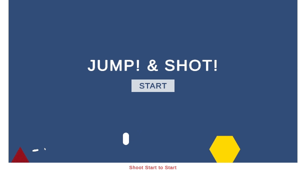

<h1>Jump & Shot!</h1>

 
심플한 2D 플랫포머 + 슈팅 게임입니다.
<h2> 어떤 요소가 포함되어야 게임이 '재미'있어지나?</h2>

저는 게임의 재미를 이끌어내는 가장 큰 요소는 ‘유저의 자유로움’이라고 생각합니다.

그렇게 <b>'자유로움'</b>이라는 주제로 제작한 크래프톤 입학시험 미니 프로젝트 입니다.

<h3>조건</h3>
1. Unity2D를 활용한 플랫포머 게임일 것. 
2. 아트 요소는 기본적인 빌트인 오브젝트만 활용할것 (ex. Cube, Sphere...) 
3. 버그없이 처음부터 끝까지 게임 플레이가 가능할 것

## How To Play

- 시작
  - 클릭하여 총알을 발사해 Start버튼을 파괴하면 시작
  - 로비에서부터 자유로운 플레이 가능
  
    

 

- 조작
  - wasd / Shift - 이동 / 달리기
  - Space - 점프
  - 좌클릭 - 발사
  
    

     

- 오브젝트
  - 흰색 큐브 : 벽 / 바닥
  - 빨간 삼각형 : 장애물, 파괴가능, 닿을 시 게임오버
  - 깃발 : 세이브 포인트
  - 노란 육각형 : 스테이지 목표

    

 

- 목표
  - 노란색 육각형에 도달하면 Stage 클리어 
  - 일정 시간 후 메인화면으로 돌아감

    

     
  
- 비밀 스테이지?
  - 특수 능력(더블점프)를 가능하게 하는 아이템 존재
  - 수상한 곳은 세심하게 살펴 보는 것이 중요

    

     